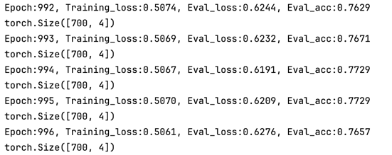
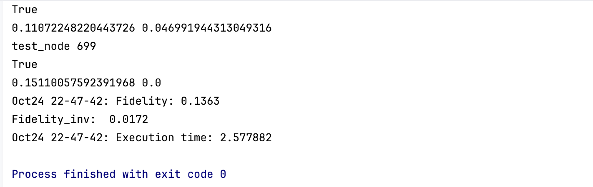
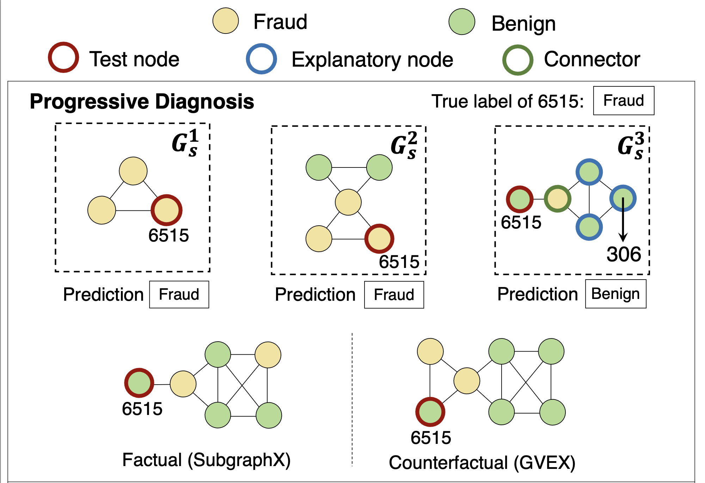

## SliceGX
This repository contains the source code for our paper: SliceGX: Layer-wise GNN Explanation with Model-slicing.

Full version: [2025ICDE_SliceGX.pdf](https://github.com/TingtingZhu-ZJU/SliceGX/blob/main/Full_version.pdf)

## Requirements
- Pytorch 1.10.1
- PYG 2.1.0
- matplotlib, scipy, networkx, hydra, numpy ...

## datasets
- [Ba-shapes](https://github.com/divelab/DIG_storage/blob/main/xgraph/datasets/BA_shapes.pkl)
- [Tree-Cycles](https://github.com/divelab/DIG_storage/blob/main/xgraph/datasets/Tree_Cycles.pkl)
- [Cora](https://github.com/kimiyoung/planetoid/tree/master/data)
- [YelpChi](https://github.com/AI4Risk/antifraud/blob/main/data/YelpChi.zip)
- [Coauthor CS](https://github.com/shchur/gnn-benchmark/raw/master/data/npz/)
- [Amazon](https://docs.google.com/uc?export=download&id=17qhNA8H1IpbkkR-T2BmPQm8QNW5do-aa&confirm=t)

## Structure
- checkpoints: store the trained model.
- config: the parameters of the algorithm and model.
- datasets: datasets used in the experiments.
- dataset.py: datasets processing and loading.
- gnnNets.py: model parameters and architecture.
- SliceGX.py/Slice_MS.py/Slice_MM.py: the SliceGX algorithm.
- train_model.py: train the model.
- utils.py: some help functions.
- Gnnexplainer.py/graphmask.py/pgexplainer_edges.py/subgraphx.py/random_explain.py: baselines.

## Usage
1. Download datasets.
2. Configure the training parameters and run train_gnn.py to train the model(stored in checkpoints):
    > learning_rate: 0.001 
    > weight_decay: 5e-4 
    > milestones: None 
    > gamma: None 
    > batch_size: 1 
    > num_epochs: 2000 
    > num_early_stop: 0 
    > gnn_latent_dim: 
    >     - 20 
    >     - 20 
    >     - 20 
    > gnn_dropout: 0.0 
    > add_self_loop: True 
    > gcn_adj_normalization: False 
    > gnn_emb_normalization: False 
    > graph_classification: False 
    > node_classification: True 
    > gnn_nonlinear: 'relu' 
    > readout: 'identity' 
    > fc_latent_dim: [ ] 
    > fc_dropout: 0.0 
    > fc_nonlinear: 'relu' 
    > concate: False 
    

4. Config the algorithm parameters in config folder.
   > dataset_root: 'datasets' 
   > dataset_name: 'ba_shapes' 
   > random_split_flag: False 
   > data_split_ratio: [0.8, 0.1, 0.1] 
   > seed: 2 
   > num_classes: 4 
   > K: [2, 4, 6, 8, 10] 
   > h: [ 0.1,0.2,0.3 ] 
   > theta: [ 0.1,0.2,0.3 ] 
   > gamma: 0.5 
6. Run Gnnexplainer.py/graphmask.py/pgexplainer_edges.py/subgraphx.py/random_explain.py or SliceGX.py/Slice_MS.py/Slice_MM.py to generate the explanations.

## Figures

